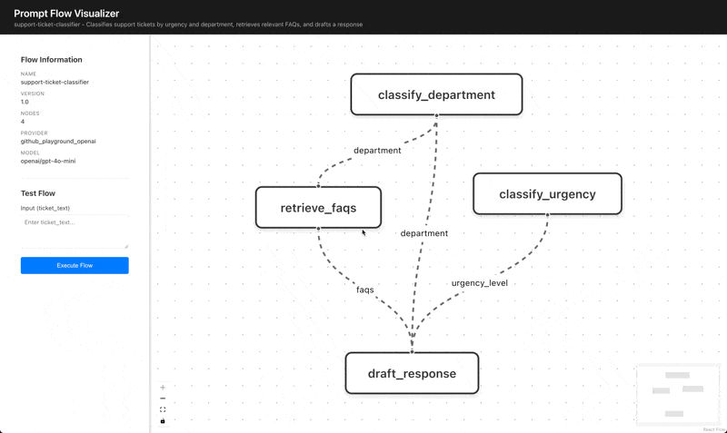

# Prompt Flow

A cloud-agnostic tool for leveraging prompt flows. Build reproducible, version-controlled generative AI workflows without being locked into any cloud provider tools.



> **NOTE:**\
> This project is under active development. This means it's a great time to give feedback! But also keep in mind that things will change. Breaking changes are to be expected.

## What is a Prompt Flow?

Imagine if instead of having a single, complex prompt for an LLM, you could break it down into several hyper-focused prompts. Each one would have a distinct task to perform and no knowledge of the other prompts. This creates that are closely aligned with what you intended.

A prompt flow is a structured workflow that coordinates interactions between LLMs and dynamically builds prompts to accomplish multi-step generative AI tasks. Instead of a single, complex prompt, flows break down tasks into discrete nodes that form a directed acyclic graph (DAG), making them easier to test, debug, and maintain.

> _"If it's so great then why don't systems do this already instead of just making one model call?"_\
> ~You

Some systems do. They may include complex code to handle each scenario or leverage existing solutions such as Azure Prompt Flows or AWS Bedrock Flows. The issue with these is that **_they lock you in!!_** You're prompt configurations are stored within their system with no easy way to export them. Additionally, since they are accessed via a web editor and stored in their cloud there is no easy way to version control your prompts.

### The Solution

This repo contains an open-source implementation of prompt flows. It is built with developers in mind. It lets you store your flow configurations as YAML, making them easily controlled using any version control system (eg. Git). There CLI which contains all the bells and whistles needed for developing prompt flows, including initialising a new flow, testing a flow using real model calls, visualising a flow graph in the browser, etc. All while being vendor-agnostic, allowing you to use whichever cloud provider is right for you.

## Features

- **Vendor Agnostic**: Define flows in YAML or JSON, not tied to any cloud provider
- **Version Control**: Store flow definitions alongside your code using your tool of choice (eg. Git)
- **Visual DAG Editor**: Web UI for visualizing and testing flows as a graph
- **Multi-Provider Support**: Built-in support for OpenAI, Anthropic, and GitHub Playground, with extensible provider interface and PRs welcome
- **Local Development**: Run and test flows entirely on your local machine
- **Cost Tracking**: Automatic token usage and cost estimation for each execution
- **Test Mode**: Execute flows with sample inputs and inspect node-by-node results

## Installation

## Go Install

If you have Go installed you may install the tool as follows:

```bash
go install ./cmd/pfctl
```

Follow [these steps](https://go.dev/doc/install) to install Go if you would like to use it.

## Build Locally

Clone the repository:

```bash
git clone https://github.com/broderick/prompt-flow.git
cd prompt-flow
```

Build the CLI with [task](https://taskfile.dev/) or manually:

```bash
# With task
task build.cli

# OR

# Manually
cd web
npm run build
cd ..
go build -o pfctl ./cmd/pfctl
```

Either way you will get a `pfctl` file that can be run with `./pfctl`.

## Quick Start

### 1. Initialize a new flow

```bash
pfctl init my-first-flow
```

This creates `my-first-flow.flow.yaml` with a basic structure.

### 2. Validate your flow

```bash
pfctl validate my-first-flow.flow.yaml
```

This will tell you whether or not your flow is structured correctly, which is helpful to do after making changes.

### 3. Test your flow

Set up your API keys depending on what provider your flow uses.

This table shows what environment variable to use for each provider:

| Provider                 | Environment Variable  | Type                                                                                                                                                                                                                                                                             |
| ------------------------ | --------------------- | -------------------------------------------------------------------------------------------------------------------------------------------------------------------------------------------------------------------------------------------------------------------------------- |
| openai                   | OPENAI_API_KEY        | [API Key](https://platform.openai.com/api-keys)                                                                                                                                                                                                                                  |
| anthropic                | ANTHROPIC_API_KEY     | [API Key](https://console.anthropic.com/settings/keys)                                                                                                                                                                                                                           |
| github_playground_openai | GITHUB_PLAYGROUND_PAT | [Personal Access Token](https://github.com/settings/personal-access-tokens/new?description=Used+to+call+GitHub+Models+APIs+to+easily+run+LLMs%3A+https%3A%2F%2Fdocs.github.com%2Fgithub-models%2Fquickstart%23step-2-make-an-api-call&name=GitHub+Models+token&user_models=read) |

> 💡 **TIP:**\
> [GitHub Playground](https://github.com/marketplace/models/azure-openai/gpt-4o-mini/playground) is a great service for developers to test different models without paying.

\
Once you have your API key you can set the correct environment variable (as shown in the above table). For example, if I was using the `openai` provider and I had an OpenAI API key "2249318986310082" then I could set the variable like so:

```bash
export OPENAI_API_KEY="2249318986310082"
```

Then you can run the flow:

```bash
pfctl test my-first-flow.flow.yaml -i user_input="Hello, what's the weather like?"
```

### 4. Launch the web UI

The `test` subcommand was good for a simple flow, but as you add nodes and have more complex inputs/outputs it will be easier to follow what's happening in a visual manner. This is why we created the `serve` subcommand. It runs a local web server that is packed with tools for developing great prompt flows.

You can start the server using this command:

```bash
pfctl serve -f my-first-flow.flow.yaml
```

This will start the server. Be sure to let it run. Open http://localhost:8080 to visualize and test your flow in the browser. The GIF at the top of this document is a demo of the UI.

## Flow Definition Format

Flows are defined in YAML or JSON with the following structure:

### Top-Level Fields

- `version` (string): Flow definition version (currently "1.0")
- `name` (string): Flow name
- `description` (string): Optional description
- `config` (object): Flow-level configuration
  - `default_provider` (string): Default LLM provider ("openai", "anthropic")
  - `default_model` (string): Default model name
- `nodes` (array): List of nodes in the flow

### Node Structure

Each node represents a step in the flow:

```yaml
- id: "node_id" # Unique identifier
  type: "llm" # Node type (currently only "llm" supported)
  provider: "openai" # Optional: override default provider
  model: "gpt-4" # Optional: override default model
  inputs: # Input sources
    - name: "input_name"
      from: "input" # "input" for flow input, or "node_id.output_name"
  prompt: | # Go template for the prompt
    Your prompt here with {{.input_name}} placeholders
  outputs: # Output definitions
    - name: "output_name"
      to: "output" # "output" to expose as flow output (optional)
  settings: # Optional provider-specific settings
    temperature: 0.7
    max_tokens: 1000
```

### Data Flow

Nodes connect through inputs and outputs:

- **Flow inputs**: Use `from: "input"` to accept data when the flow is executed
- **Node outputs**: Reference as `from: "node_id.output_name"` in downstream nodes
- **Flow outputs**: Set `to: "output"` to expose node output as final result

### Example: Multi-Node Flow

```yaml
version: "1.0"
name: "support-ticket-classifier"
description: "Classifies and routes support tickets"

config:
  default_provider: "openai"
  default_model: "gpt-3.5-turbo"

nodes:
  # Node 1: Classify urgency
  - id: "classify_urgency"
    type: "llm"
    inputs:
      - name: "ticket_text"
        from: "input"
    prompt: |
      Classify this ticket's urgency as high, medium, or low:
      {{.ticket_text}}

      Output only: high, medium, or low
    outputs:
      - name: "urgency_level"

  # Node 2: Classify department
  - id: "classify_department"
    type: "llm"
    inputs:
      - name: "ticket_text"
        from: "input"
    prompt: |
      Classify this ticket by department: billing, engineering, or sales
      {{.ticket_text}}

      Output only the department name.
    outputs:
      - name: "department"

  # Node 3: Draft response (depends on both classifications)
  - id: "draft_response"
    type: "llm"
    inputs:
      - name: "ticket_text"
        from: "input"
      - name: "urgency"
        from: "classify_urgency.urgency_level"
      - name: "department"
        from: "classify_department.department"
    prompt: |
      Draft a response to this {{.urgency}} urgency {{.department}} ticket:
      {{.ticket_text}}
    outputs:
      - name: "response"
        to: "output"
```

## Extending with Custom Providers

To add support for a new LLM provider:

1. Implement the `Provider` interface in `pkg/providers/`:

```go
type Provider interface {
    Name() string
    Complete(ctx context.Context, req CompletionRequest) (*CompletionResponse, error)
}
```

2. Register your provider in the executor:

```go
registry := providers.NewRegistry()
... // Existing providers
registry.Register(NewMyCustomProvider()) // Your provider
```

See existing providers within `pkg/providers/` for examples.

## Roadmap

- [ ] Support for custom node types (HTTP calls, database queries)
- [ ] Flow composition (call flows from other flows)
- [ ] Conditional branching and loops
- [ ] Live editing in web UI with auto-save
- [ ] Flow versioning and snapshots
- [ ] Deployment to serverless functions
- [ ] Integration testing framework
- [ ] Prompt variant comparison (A/B testing)

## Contributing

Contributions are welcome! Please open an issue or submit a pull request.

## Acknowledgments

Inspired by Azure Prompt Flow and AWS Bedrock Flows, but designed from scratch to be open, local-first, and cloud-agnostic.
