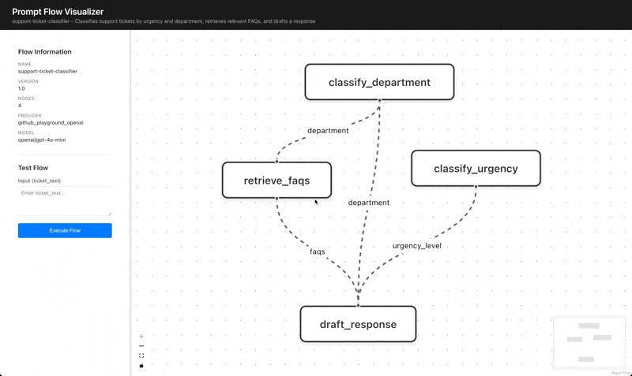

# Prompt Flow

A vendor-agnostic engine for running LLM prompt flows. Designed for both local development and production deployment as serverless functions.



> **NOTE:**\
> This project is under active development. This means it's a great time to give feedback! But also keep in mind that things will change. Breaking changes are to be expected.

## What is a Prompt Flow?

Imagine if instead of having a single, complex prompt for an LLM, you could break it down into several hyper-focused prompts. Each one would have a distinct task to perform and no knowledge of the other prompts. This creates that are closely aligned with what you intended.

A prompt flow is a structured workflow that coordinates interactions between LLMs and dynamically builds prompts to accomplish multi-step generative AI tasks. Instead of a single, complex prompt, flows break down tasks into discrete nodes that form a directed acyclic graph (DAG), making them easier to test, debug, and maintain.

> _"If it's so great then why don't systems do this already instead of just making one model call?"_\
> ~You

Some systems do. They may include complex code to handle each scenario or use existing solutions such as Azure Prompt Flows or AWS Bedrock Flows. The issue with these is that **_they lock you in!!_** Your prompt configurations are stored within their system with no easy way to export them. Additionally, since they are accessed via a web editor and stored in their cloud there is no easy way to version control your prompts.

### The Solution

This repo contains an open-source implementation of prompt flows. It is built with developers in mind. It lets you store your flow configurations as YAML, making them easily controlled using any version control system (eg. Git). The CLI (`pfctl`) contains all the bells and whistles needed for developing prompt flows, including initializing a new flow, testing a flow using real model calls, visualizing a flow graph in the browser, etc. All while being vendor-agnostic, allowing you to use whichever cloud provider is right for you.

## Features

- **Vendor Agnostic**: Define flows in YAML or JSON, not tied to any cloud provider
- **Version Control**: Store flow definitions alongside your code using your tool of choice (eg. Git)
- **Visual DAG Editor**: Web UI for visualizing and testing flows as a graph
- **Multi-Provider Support**: Built-in support for OpenAI, Anthropic, Azure OpenAI, Google Vertex AI (Gemini), and GitHub Playground, with extensible provider interface and PRs welcome
- **Router Nodes**: Conditional branching based on LLM output, so your flow can take different paths depending on results
- **Parallel Execution**: Independent nodes run concurrently, so flows with multiple branches execute faster
- **Serverless Deployment**: Deploy each flow as its own auto-scaling serverless function (see [Deployment Model](#deployment-model))
- **Local Development**: Run and test flows entirely on your local machine
- **Docker Support**: Ship as a single container with `docker-compose up`
- **Cost Tracking**: Automatic token usage and cost estimation for each execution
- **Test Mode**: Execute flows with sample inputs and inspect node-by-node results

## Installation

### Go install

If you have Go installed you may install the tool as follows:

```bash
go install github.com/broderick/prompt-flow/cmd/pfctl
```

Follow [these steps](https://go.dev/doc/install) to install Go if you would like to use it.

### Build locally

Clone the repository:

```bash
git clone https://github.com/broderick/prompt-flow.git
cd prompt-flow
```

Build the CLI with [task](https://taskfile.dev/) or manually:

```bash
# With task
task build.cli

# OR

# Manually
cd web
npm run build
cd ..
go build -o pfctl ./cmd/pfctl
```

Either way you will get a `pfctl` file that can be run with `./pfctl`.

### Docker

If you'd rather not install Go or Node.js, you can run `pfctl` as a container:

```bash
docker-compose up
```

This builds the image, mounts the `examples/` directory, and starts the web UI on port 8080. To use your own flow files, edit the `command` in `docker-compose.yml` or mount a different directory.

You can also build and run the Docker image directly:

```bash
# Build
docker build -t pfctl .

# Run (pass API keys via .env file or -e flags)
docker run -p 8080:8080 --env-file .env -v ./my-flows:/flows:ro pfctl serve -p 8080 /flows/my-flow.flow.yaml
```

## Quick Start

### 1. Initialize a new flow

```bash
pfctl init my-first-flow
```

This creates `my-first-flow.flow.yaml` with a basic structure.

### 2. Validate your flow

```bash
pfctl validate my-first-flow.flow.yaml
```

This will tell you whether or not your flow is structured correctly, which is helpful to do after making changes.

### 3. Test your flow

Set up your API keys depending on what provider your flow uses.

This table shows what environment variable to use for each provider:

| Provider                 | Environment Variable  | Type                                                                                                                                                                                                                                                                             |
| ------------------------ | --------------------- | -------------------------------------------------------------------------------------------------------------------------------------------------------------------------------------------------------------------------------------------------------------------------------- |
| openai                   | OPENAI_API_KEY        | [API Key](https://platform.openai.com/api-keys)                                                                                                                                                                                                                                  |
| anthropic                | ANTHROPIC_API_KEY     | [API Key](https://console.anthropic.com/settings/keys)                                                                                                                                                                                                                           |
| vertex_ai                | GCP_PROJECT_ID        | GCP Project ID (also requires [Application Default Credentials](https://cloud.google.com/docs/authentication/application-default-credentials): run `gcloud auth application-default login`). Optionally set `GCP_LOCATION` (defaults to `us-central1`).                          |
| azure_openai             | AZURE_OPENAI_ENDPOINT | Azure OpenAI resource endpoint (e.g., `https://your-resource.openai.azure.com/`). Also set `AZURE_OPENAI_API_KEY`. The `model` field in flow YAML maps to your Azure deployment name (e.g., if your deployment is named `my-gpt4o`, use `model: "my-gpt4o"`). |
| github_playground_openai | GITHUB_PLAYGROUND_PAT | [Personal Access Token](https://github.com/settings/personal-access-tokens/new?description=Used+to+call+GitHub+Models+APIs+to+easily+run+LLMs%3A+https%3A%2F%2Fdocs.github.com%2Fgithub-models%2Fquickstart%23step-2-make-an-api-call&name=GitHub+Models+token&user_models=read) |

> 💡 **TIP:**\
> [GitHub Playground](https://github.com/marketplace/models/azure-openai/gpt-4o-mini/playground) is a great service for developers to test different models without paying.

\
Once you have your API key you can set the correct environment variable (as shown in the above table). For example, if I was using the `openai` provider and I had an OpenAI API key "2249318986310082" then I could set the variable like so:

```bash
export OPENAI_API_KEY="2249318986310082"
```

Then you can run the flow:

```bash
pfctl test my-first-flow.flow.yaml -i user_input="Hello, what's the weather like?"
```

### 4. Launch the web UI

The `test` subcommand was good for a simple flow, but as you add nodes and have more complex inputs/outputs it will be easier to follow what's happening in a visual manner. This is why we created the `serve` subcommand. It runs a local web server that is packed with tools for developing great prompt flows.

You can start the server using this command:

```bash
pfctl serve my-first-flow.flow.yaml
```

This will start the server. Be sure to let it run. Open http://localhost:8080 to visualize and test your flow in the browser. The GIF at the top of this document is a demo of the UI.

| Flag | Default | Description                                        |
| ---- | ------- | -------------------------------------------------- |
| `-p` | 8080    | Port to listen on                                  |
| `-t` | 5m      | Execution timeout for flow runs                    |
| `-s` | false   | Show start and end nodes in the flow visualization |

## Deployment Model

`pfctl` is the engine. You bring your flows.

The design is simple: each flow deploys as its own serverless function. One Docker image per flow, one [service](https://www.serverless.com/framework/docs/providers/aws/guide/intro#services) per flow. Each service auto-scales independently, including scaling to zero when there's no traffic (if configured that way).

```
Your repo                    Build                     Deploy
+-----------------------+    +--------------------+    +-------------------------+
| flows/                |    |                    |    |                         |
|   classify.flow.yaml -+--->| Docker image A     +--->| Serverless service A    |
|   summarize.flow.yaml +--->| Docker image B     +--->| Serverless service B    |
| Dockerfile            |    |                    |    |                         |
| terraform/            |    +--------------------+    +-------------------------+
+-----------------------+
```

A typical setup looks like this:

1. Your repo contains flow YAML files, a Dockerfile, and deployment config
2. The Dockerfile uses the pfctl base image and copies in your flow file
3. CI/CD builds one image per flow and deploys each as a serverless service

See [`examples/deploy/Dockerfile.example`](examples/deploy/Dockerfile.example) for a starting point and [`examples/deploy/README.md`](examples/deploy/README.md) for the full deployment guide.

### Deploying to GCP Cloud Run

The [`examples/deploy/gcp/`](examples/deploy/gcp/) directory contains reference Terraform modules and a GitHub Actions workflow for deploying flows to Cloud Run.

What's included:

- **Terraform module** for Cloud Run, Artifact Registry, Secret Manager, and IAM
- **GitHub Actions workflow** for building, pushing, and deploying images

Prerequisites: a GCP project, Workload Identity Federation for CI/CD auth, and the `gcloud` CLI.

Each flow gets its own Cloud Run service. The Terraform module creates one service per flow, each backed by its own container image. See the [deploy README](examples/deploy/README.md) for details.

### Deploying to Azure Container Apps

The [`examples/deploy/azure/`](examples/deploy/azure/) directory contains reference Terraform modules and a GitHub Actions workflow for deploying flows to Azure Container Apps.

What's included:

- **Terraform module** for Container Apps, ACR, Key Vault, and Managed Identity
- **GitHub Actions workflow** for building, pushing, and deploying images

Prerequisites: an Azure subscription, the Azure CLI, Terraform, OIDC federation for CI/CD auth, and a pre-existing Azure OpenAI resource (if using the Azure OpenAI provider).

Each flow gets its own Container App. The Terraform module creates one service per flow, each backed by its own container image. See the [deploy README](examples/deploy/README.md) for details.

## Flow Definition Format

Flows are defined in YAML or JSON with the following structure:

### Top-Level Fields

- `version` (string): Flow definition version (currently "1.0")
- `name` (string): Flow name
- `description` (string): Optional description
- `config` (object): Flow-level configuration
  - `default_provider` (string): Default LLM provider (e.g. "openai", "anthropic", "vertex_ai", "github_playground_openai")
  - `default_model` (string): Default model name
- `nodes` (array): List of nodes in the flow

### Node Structure

Each node represents a step in the flow:

```yaml
- id: "node_id" # Unique identifier
  type: "llm" # Node type: "llm" or "router"
  provider: "openai" # Optional: override default provider
  model: "gpt-4" # Optional: override default model
  inputs: # Input sources
    - name: "input_name"
      from: "input" # "input" for flow input, or "node_id.output_name"
  prompt: | # Go template for the prompt
    Your prompt here with {{.input_name}} placeholders
  outputs: # Output definitions
    - name: "output_name"
      to: "output" # "output" to expose as flow output (optional)
  settings: # Optional provider-specific settings
    temperature: 0.7
    max_tokens: 1000
```

### Data Flow

Nodes connect through inputs and outputs:

- **Flow inputs**: Use `from: "input"` to accept data when the flow is executed
- **Node outputs**: Reference as `from: "node_id.output_name"` in downstream nodes
- **Flow outputs**: Set `to: "output"` to expose node output as final result

### Example: Multi-Node Flow

```yaml
version: "1.0"
name: "support-ticket-classifier"
description: "Classifies and routes support tickets"

config:
  default_provider: "openai"
  default_model: "gpt-3.5-turbo"

nodes:
  # Node 1: Classify urgency
  - id: "classify_urgency"
    type: "llm"
    inputs:
      - name: "ticket_text"
        from: "input"
    prompt: |
      Classify this ticket's urgency as high, medium, or low:
      {{.ticket_text}}

      Output only: high, medium, or low
    outputs:
      - name: "urgency_level"

  # Node 2: Classify department
  - id: "classify_department"
    type: "llm"
    inputs:
      - name: "ticket_text"
        from: "input"
    prompt: |
      Classify this ticket by department: billing, engineering, or sales
      {{.ticket_text}}

      Output only the department name.
    outputs:
      - name: "department"

  # Node 3: Draft response (depends on both classifications)
  - id: "draft_response"
    type: "llm"
    inputs:
      - name: "ticket_text"
        from: "input"
      - name: "urgency"
        from: "classify_urgency.urgency_level"
      - name: "department"
        from: "classify_department.department"
    prompt: |
      Draft a response to this {{.urgency}} urgency {{.department}} ticket:
      {{.ticket_text}}
    outputs:
      - name: "response"
        to: "output"
```

### Parallel execution

Nodes that don't depend on each other run concurrently. In the support ticket example above, `classify_urgency` and `classify_department` both take `ticket_text` from the flow input and don't reference each other, so they execute at the same time. `draft_response` waits for both to finish before it runs.

You don't need to configure this. The executor analyzes the dependency graph and groups nodes into levels automatically.

### Router nodes

Router nodes let you branch a flow based on the output of a previous node. Instead of sending every ticket through the same path, you can route it to a specialized handler.

A router node takes a single input, evaluates it against a list of conditions, and sends execution down the matching path. Unmatched paths (and their downstream nodes) are skipped.

```yaml
- id: route_department
  type: router
  inputs:
    - name: category
      from: classifier.category
  routes:
    - when: '== "billing"'
      next: handle_billing
    - when: '== "technical"'
      next: handle_technical
    - default: true
      next: handle_general
```

The `when` field supports these expressions:

| Expression           | Description     |
| -------------------- | --------------- |
| `== "value"`         | Exact match     |
| `!= "value"`         | Not equal       |
| `contains "value"`   | Substring match |
| `startsWith "value"` | Prefix match    |
| `endsWith "value"`   | Suffix match    |

Every router should have a `default: true` route as a fallback. See `examples/flows/routed-support-ticket.flow.yaml` for a complete working example.

## Extending with custom providers

To add support for a new LLM provider:

1. Implement the `Provider` interface in `pkg/providers/`:

```go
type Provider interface {
    Name() string
    Complete(ctx context.Context, req CompletionRequest) (*CompletionResponse, error)
}
```

2. Register your provider in the executor:

```go
registry := providers.NewRegistry()
... // Existing providers
registry.Register(NewMyCustomProvider()) // Your provider
```

See existing providers within `pkg/providers/` for examples.

## Contributing

Contributions are welcome! Please open an issue or submit a pull request.

## Acknowledgments

Inspired by Azure Prompt Flow and AWS Bedrock Flows, but designed from scratch to be open, local-first, and cloud-agnostic.
